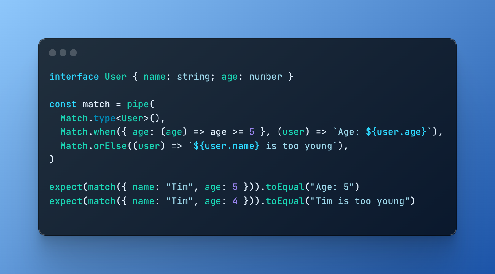

<h3 align="center">
  
</h3>

<p align="center">
Functional pattern matching with the full power of Typescript.
</p>

## Getting started

To install from npm:

```
npm install @effect/match
```

Once you have installed the library, you can import the necessary types and functions from the `@effect/match` module.

```ts
import * as Match from "@effect/match"
```

## Defining a Matcher

To define a `Matcher` from a given type, you can use the `type` constructor function.

You can then use the `when`, `not` & `tag` combinators to specify the patterns to match against.

For example:

```ts
import * as S from "@fp-ts/schema"
import * as Match from "@effect/match"

const match = pipe(
  Match.type<{ a: number } | { b: string }>(),
  Match.when({ a: S.number }, (_) => _.a),
  Match.when({ b: S.string }, (_) => _.b),
  Match.exhaustive,
)

console.log(match({ a: 0 })) // 0
console.log(match({ b: "hello" })) // "hello"
```

You can also create a `Matcher` from a value using the `value` constructor function.

For example:

```ts
import * as Match from "@effect/match"

const result = pipe(
  Match.value({ name: "John", age: 30 }),
  Match.when(
    { name: "John" },
    (user) => `${user.name} is ${user.age} years old`,
  ),
  Match.orElse(() => "Oh, not John"),
)

console.log(result) // "John is 30 years old"
```

## Types of patterns

### Predicates

Values can be tested against arbitrary functions.

```ts
import * as Match from "@effect/match"

const match = pipe(
  Match.type<{ age: number }>(),
  Match.when({ age: (age) => age >= 5 }, (user) => `Age: ${user.age}`),
  Match.orElse((user) => `${user.age} is too young`),
)

console.log(match({ age: 5 })) // "Age: 5"
console.log(match({ age: 4 })) // "4 is too young"
```

### `not` matcher

`not` lets you match on everything but a specific value or Schema.

```ts
import * as Match from "@effect/match"

const match = pipe(
  Match.type<string | number>(),
  Match.not("hi", (_) => "a"),
  Match.orElse(() => "b"),
)

console.log(match("hello")) // "a"
console.log(match("hi")) // "b"
```

## Credits

This library is built upon [@fp-ts/schema](https://github.com/fp-ts/schema).

## License

The MIT License (MIT)
